<div align="center">


<br>

**Un client Discord complet, en français, qui bloque les liens piégés avant que tu cliques,<br>
coupe la télémétrie, et t'explique ce qu'il fait au lieu de te demander de le croire.**

<br>


[**Site officiel**](https://nexium-client.netlify.app/) &nbsp;·&nbsp; [**État des services**](https://omega-devj.github.io/status-nexium/) &nbsp;·&nbsp; [**Signaler un problème**](../../issues)

</div>

<br>

---

<div align="center">

## Installation — une commande, trente secondes

</div>

Ouvre **PowerShell** (touche Windows → tape `powershell` → Entrée) et colle :

```powershell
irm https://raw.githubusercontent.com/Omega-devj/nexium-client/main/install-nexium.ps1 | iex
```

<div align="center">

</div>

C'est tout. **Aucun droit administrateur**, rien dans la base de registre, rien ailleurs
que dans ton dossier utilisateur.

Nexium **démarre avec Windows**, réduit, via un raccourci posé dans ton dossier Démarrage
(`shell:startup`). Supprime ce raccourci et il ne se lancera plus tout seul — Nexium
Données te donne la commande qui le fait.

<details>
<summary><b>Installation manuelle, si tu préfères tout poser toi-même</b></summary>

<br>

1. Bouton vert **`Code` → `Download ZIP`**, décompresse où tu veux → `nexium-client-main`.
2. Récupère le lanceur `.exe` dans l'onglet [Releases](../../releases).
3. Pose le `.exe` **à la racine** du dossier, à côté des autres fichiers — pas dans un sous-dossier.
4. Lance-le.
5. Pour qu'il démarre avec Windows : `Windows + R`, tape `shell:startup`, et glisse un raccourci du `.exe` dans le dossier qui s'ouvre.

</details>

<br>

---

<div align="center">

## Un lien piégé ne s'ouvre pas


</div>

Loggers d'IP, faux serveurs officiels, domaines qui imitent une marque, liens masqués
dont le texte affiché ment sur la destination : tout est analysé **avant** que tu
cliques, contre une base distante de plus de 250 000 domaines. Un `.exe` renommé en
`.png` est repéré à son contenu réel, pas à son nom.

Protect détecte aussi l'usurpation d'amis, les vagues de messages privés coordonnées,
les fuites de jeton ou de webhook, et l'arnaque « colle ce code dans la console ».
Trois profils au choix : **strict**, **équilibré**, **minimal**.

<br>

---

<div align="center">

## Rien ne sort sans que tu le saches



</div>

Vingt-quatre réglages, du blocage de la télémétrie jusqu'à l'empreinte matérielle
normalisée et aux noms de fichiers anonymisés à l'envoi. Cinq gardes de sortie
surveillent ce qui quitte ta machine — webhooks, requêtes vers des serveurs inconnus,
balises invisibles, scripts injectés dans la fenêtre, code qu'un thème voudrait exécuter.

Des **heures discrètes** basculent le profil toutes seules, un **bilan de la semaine**
résume ce qui a été arrêté, et le **journal** liste chaque blocage, un par un.

<br>

---

<div align="center">

## Les modules

</div>

| | Module | Ce qu'il fait |
|---|---|---|
| 🛡️ | **Protect** | Analyse des liens, des pièces jointes, des aperçus et des invitations. Usurpation d'amis, vagues de MP, fuites de jeton, arnaque à la console. |
| 🔒 | **Privacy** | 24 réglages, trois profils, heures discrètes, bilan hebdomadaire et journal complet. |
| 📡 | **Réseau** | Latence, gigue, stabilité, inventaire en direct des hôtes contactés. |
| 📊 | **Stats** | Ton activité, calculée et gardée **uniquement sur ta machine**. |
| ⚡ | **Auto** | Automatisations et mode focus, avec sessions minutées. |
| 🎧 | **Music** | Lecteur intégré, playlist, mini-lecteur déplaçable. |
| 💾 | **Données** | Tout ce qui est stocké, export/import des réglages, journal d'erreurs, diagnostic. |
| 🔄 | **Mise à jour** | Version installée, notes de version, retour arrière. |

Tout suit **ton thème Discord** — clair, sombre, thèmes personnalisés et QuickCSS.

<br>

---

<div align="center">

## Ce qui sort de ta machine

*Plutôt que de promettre « zéro donnée », voici la liste exacte.*

</div>

| | Quand | Contenu |
|---|---|---|
| **Enregistrement** | Au démarrage, une fois par heure au plus | Ton identifiant Discord et la version du client |
| **Signalement** | **Seulement si tu cliques sur « Signaler »** | Le domaine signalé, son type, ton identifiant et ton pseudo |

**Jamais envoyé** — aucun message, aucun contenu de conversation, aucun jeton, aucun
mot de passe, aucune statistique d'usage, aucun traceur tiers.

**Téléchargé, sans rien envoyer** — la base de menaces, la liste blanche, la liste de
bannissement, les notes de version et les mises à jour.

> Tout est vérifiable : le code est intégralement lisible ici, rien n'est compilé en
> boîte noire, et Nexium Réseau te montre en direct les requêtes que le client émet.

<br>

---

<div align="center">

## À savoir avant d'installer

*Ce sont de vraies contraintes, pas des formalités.*

</div>

- **Ce client modifie Discord**, ce qui va à l'encontre de ses conditions d'utilisation.
  Un bannissement reste théoriquement possible. En pratique c'est rare, mais le risque
  n'est jamais nul.
- **Le client se met à jour tout seul** : à chaque démarrage il télécharge la dernière
  version depuis ce dépôt et l'exécute. Tu fais donc confiance au mainteneur **pour le
  code qu'il publiera demain**, pas seulement pour celui d'aujourd'hui.
- **Le `.exe` n'est pas signé.** SmartScreen et certains antivirus le signaleront.
  C'est attendu pour ce type d'outil — à toi d'en juger.
- **Windows uniquement.**

<br>

---

<div align="center">

## Quand quelque chose casse, tu es prévenu

</div>

Une [**page de statut publique**](https://omega-devj.github.io/status-nexium/) vérifie
les services en direct, avec six niveaux d'alerte et 90 jours d'historique. Si un
incident est déclaré, un bandeau apparaît dans le client. Plus besoin de deviner si le
problème vient de toi.

<br>

---

## Mises à jour

À chaque lancement, le client récupère la dernière version et l'applique **avant** de
démarrer Discord. Un seul redémarrage suffit.

Une version n'est appliquée que si elle passe tous les contrôles : numéro supérieur,
taille suffisante, modules attendus présents, fonctions critiques en place, et somme
de contrôle conforme. Sinon la version installée est conservée.

Trois filets : **sauvegarde** de la version précédente, **auto-réparation** si le
fichier est corrompu, et **retour arrière** depuis Nexium Mise à jour.

Pour figer ta copie (utile si tu bricoles le code) : crée un fichier vide
`.nexium-dev` dans `resources/equicord`. Supprime-le pour réactiver.

<br>

---

## En cas de problème

**Le client rame ou se comporte mal**
`Ctrl + Maj + N` → *Désactiver la restauration des icônes de plugins*. C'est la seule
fonction qui intervient dans l'interface de Discord.

**Savoir si ça vient de Nexium ou de Discord**
Ferme Discord, renomme `resources/equicord/renderer.js` en `renderer.js.off`, crée un
fichier vide `.nexium-dev` à côté, relance. Si le problème persiste, il ne vient pas de
Nexium. Remets tout ensuite.

**Remonter un bug utilement**
Nexium Données → *Journal des erreurs* → **Copier tout**, puis joins-le à une
[issue](../../issues). Les erreurs de la session précédente y figurent aussi, même
après un plantage.

**Si Discord redémarre plusieurs fois d'affilée**, le mode sécurisé s'active seul et
coupe les fonctions à risque.

| Autre problème | Solution |
|---|---|
| SmartScreen bloque le `.exe` | « Informations complémentaires » → « Exécuter quand même » |
| Le `.exe` ne démarre pas | Vérifie qu'il est à la **racine** du dossier |
| Discord classique déjà ouvert | Ferme-le complètement (clic droit près de l'horloge → Quitter) |
| Rien ne se met à jour | Ouvre `resources/equicord/.nexium-update.log` : il dit à chaque lancement ce qui s'est passé |

**Désinstaller** : ferme Discord, supprime le dossier, puis les deux raccourcis — celui
du Bureau et celui du dossier Démarrage (`Windows + R`, tape `shell:startup`). Rien
d'autre n'est posé ailleurs.
Pour effacer aussi tes réglages : Nexium Données → *Tout effacer*, avant de supprimer.

<br>

---

## Questions fréquentes

<details>
<summary><b>Est-ce que c'est un virus ?</b></summary>

<br>

Non. Le `.exe` relance Discord avec du code supplémentaire, entièrement lisible dans
ce dépôt. Il n'est pas signé numériquement — la signature coûte cher et peu de projets
communautaires la paient — ce qui déclenche des alertes automatiques de Windows sans
que le fichier soit malveillant. Modifier Discord correspond par ailleurs à des
comportements que les antivirus surveillent, même légitimes.

</details>

<details>
<summary><b>Est-ce que ça casse mon Discord actuel ?</b></summary>

<br>

Non. Le client tourne en parallèle et ne touche pas à ton installation officielle.
Compte, serveurs et réglages restent intacts, et tu peux revenir au Discord normal à
tout moment en rouvrant celui que tu utilisais.

</details>

<details>
<summary><b>Est-ce que ça ralentit Discord ?</b></summary>

<br>

La vérification d'un lien coûte quelques microsecondes, celle d'une requête moins
d'une microseconde, et une image d'avatar une trentaine de nanosecondes. La base de
menaces est chargée par tranches pour ne jamais figer l'interface, et les minuteries
se suspendent quand Discord passe en arrière-plan.

</details>

<details>
<summary><b>Compatible avec Vencord ou BetterDiscord ?</b></summary>

<br>

Nexium est un client autonome. Faire tourner plusieurs clients modifiés en parallèle
provoque des conflits — ce n'est pas recommandé.

</details>

<details>
<summary><b>Mac ou Linux ?</b></summary>

<br>

Pas pour le moment. Windows uniquement.

</details>

<details>
<summary><b>Comment être sûr de télécharger la bonne version ?</b></summary>

<br>

Seuls ce dépôt et [nexium-client.netlify.app](https://nexium-client.netlify.app/) font
foi. Si tu as trouvé le client ailleurs, reviens vérifier ici avant d'installer. En cas
de doute, la [page d'état](https://omega-devj.github.io/status-nexium/) indique la
version réellement publiée.

</details>

<br>

---

## Astuces

| Raccourci | Effet |
|---|---|
| **Ctrl + Maj + N** | Recherche rapide : ouvrir une page, activer une protection, vérifier les mises à jour, exporter les réglages… |

Toutes les pages se parcourent au clavier (Tab, Entrée, Échap) et respectent le
réglage système « réduire les animations ».

<br>

---

## L'équipe

| | |
|---|---|
| **5dj0** | Créateur et développeur principal |
| **kikou** | Développeur C++ / Lua / Luau |
| **elias.qsd7** | Idées et retours |

Un bug, une question, une idée ? Ouvre une [issue](../../issues), ou rejoins la
communauté depuis la page **Nexium Sponsor** du client.

<br>

---

<div align="center">

### Prêt ?

</div>

```powershell
irm https://raw.githubusercontent.com/Omega-devj/nexium-client/main/install-nexium.ps1 | iex
```

<div align="center">

<br>

**Nexium Collective** &nbsp;·&nbsp; [nexium-client.netlify.app](https://nexium-client.netlify.app/) &nbsp;·&nbsp; [État des services](https://omega-devj.github.io/status-nexium/)

Gratuit et open-source. Basé sur [Equicord](https://github.com/Equicord/Equicord).

</div>
